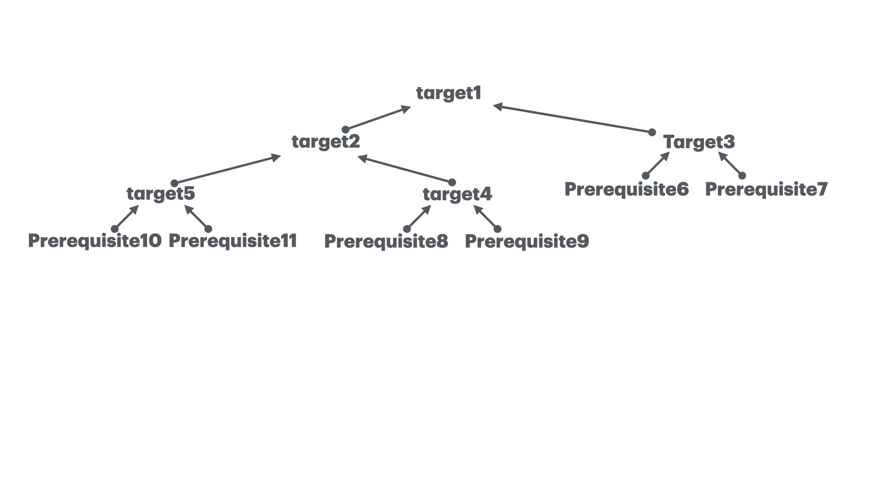

# Motivation 
The `make` program is intended to automate the mundane aspects of transforming source code into an executable. 
The advantages of `make` over scripts is that you can specify relationships between the elements of your program
to `make`. With the knowledge of the relationships and timestamps it figures out the necessary steps to be
redone to produce the desired program each time.

## A simple Makefile
The specification that `make` uses is saved in a file named _makefile_. Here is a _makefile_ to build the
traditional "Hello, World" program.

```makefile
hello: hello.c
    gcc hello.c -o hello
```

To build the program we execute `make` by typing:
```shell
$ make
```
This will cause the `make` program to read the _makefile_ and build the first target it finds there.

## Targets and Prerequisites
A _makefile_ contains a set of rules to build an application. The first rule seen by `make` is used as the
_default rule_. A _rule_ consists of three parts: the target, its prerequisites, and the command(s) to peform:

```makefile
target1: prerequisite1 prerequisite2
    command1
    command2

target2(=prerequisite1): prerequisite3 prerequisite4 prerequisite5
    command3

target3(=prerequisite2): prerequisite6 prerequisite7
    command4

target4(=prerequisite3): prerequisite8 prerequisite9
    command5

target5(=prerequisite4): prerequisite10 prerequisite11
    command6
```

The _target_ is the file that must be made. The _prerequisites_ or _dependents_ are those files that must
exist before the target can be successfully created. And _commands_ are those shell commands that will
create the target from the prerequisites.

## A Dependecy Graph

When `make` evaluates a rule, it begins by finding the files indicated by the prerequisites and target. 
If any of the prerequisites has an associated rule, `make` attempts to update those first. Next, the target
file is considered. If any prerequisite is newer than the target, the target is remade by executing the
commands. If  any of the commands generates an error, the building of the target is terminated and `make`
exits.

The previous example assume that:
- All the project source code and the _makefile_ are stored in a single directory.
- The `make` description file is called _makefile, Makefile or GNUMakefile_.
- The _makefile_ resides in the user's current directory when executing the `make` command.

